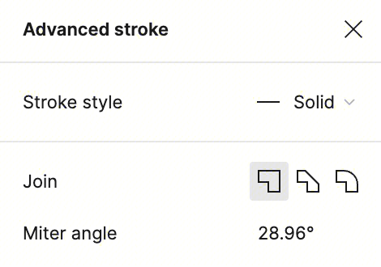
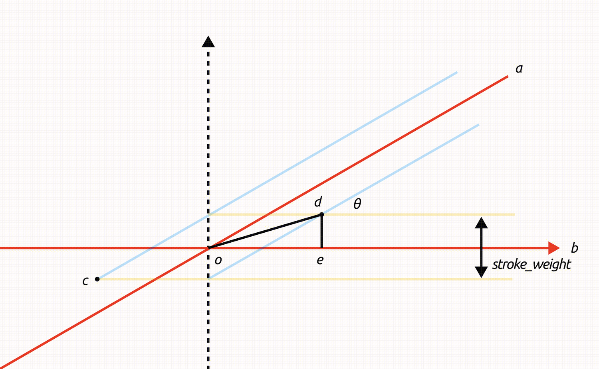

[toc]

## 前言

## strokeMiterLimit

- [Figma 文档](https://www.figma.com/plugin-docs/api/LineNode/#strokemiterlimit)
- [MDN](https://developer.mozilla.org/en-US/docs/Web/SVG/Attribute/stroke-miterlimit)

StrokeMiterLimit 决定了当两条线段相交成尖角时，尖角的形状如何显示（切为直线，还是显示）。默认为 `4`。

## strokeJoin

- [Figma 文档](https://www.figma.com/plugin-docs/api/StrokeJoin/)

StrokeJoin 是两条线段相交时的连接方式，有三个可能的值：

- `MiterJoin`：默认。尖角的角度小于或等于 *Miter Limit* 与线宽的乘积，那么尖角就会显示，否则会被裁剪为线帽（*Line Cap*）；
- `RoundJoin`：尖角会被一个半径为线宽一半的圆弧替代；
- `BevelJoin`：尖角会被一条直线段替代。

## 表单 Miter angle

除了以上两个字段，Figma 的 Advances Stroke 设置中，还有一个 Miter Angle 字段，可输入角度，且只在 StrokeJoin 设为 `MiterJoin` 时出现（因为其他两个值不会进行判断）。

然而该字段在 figma.d.ts 以及 kiwi 中没有定义，猜测可以通过计算得来，以下为推导过程。

有两条线段 *a*，*b*，相交于 *o* 点，构成的角度为 *θ*，线宽为 *stroke_weight*，线段的描边内部交于 *d* 点，外部交于 *c* 点。

> 注意：上述 *a*，*b* 两条直线是抽象后的数学符号，在 Figma 中对应一条矢量路径，有三个顶点 *a*，*o*，*b* 。单纯两条路径叠加不会产生效果。

以 *o* 点为圆心，线段 *b* 为 *x* 轴建立直角坐标系，由于线宽相等，可知 *∠doe* 为 $ \frac{θ}{2} $，过 *d* 点作 *x* 轴的垂线，交于 *e* 点，*de* 长度为 $\frac{stroke\_weight}{2}$，有：

$$
sin\frac{θ}{2} = \frac{\frac{stroke\_weight}{2}}{od}
$$

其中，线段 *cd* 如果超过 *Miter Limit* 与线宽的乘积，则会被截断，有：

$$
cd \leqslant miter\_limit * stroke\_weight
$$

*co* 与 *od* 相等，则有：

$$
2 \frac{ \frac{stroke\_weight}{2} }{ sin\frac{θ}{2} } \leqslant miter\_limit * stroke\_weight
$$

整理，得：

$$
\frac{1}{sin\frac{θ}{2}} \leqslant miter\_limit
$$

> 注意：根据定义，构建不等式使用的是 *cd* 的长度，而截断时最多只能截去 *co*。

取 *stroke_weight* 默认值 `4`，解出 *θ* 范围：

$$
[ arcsin \frac{1}{4}, \frac{π}{2} ] ∪ [3\frac{π}{2}, 2π - arcsin\frac{1}{4} ]
$$

转换为角度：

$$
[28.96°, 180°]∪[540°, 676.04°]
$$

因此 Figma 取 `28.96°`。

---

重新梳理一下三个变量：

- 两条线段的夹角 *θ*，在 Figma 这一场景下，范围永远在 [ 0°, 180° ]；
- 线宽 *stroke_weight*；
- 约束比例（姑且这么称呼） *stroke_miter_limit*；

夹角是通过路径计算产生的，线宽是通过表单设置的，约束比例无法直接通过表单设置（可通过 API 设置），但表单修改 *Miter angle* 可以影响 *strokeMiterLimit*，上述不等式（Figma 是直接取相等时的值）证明成立。
