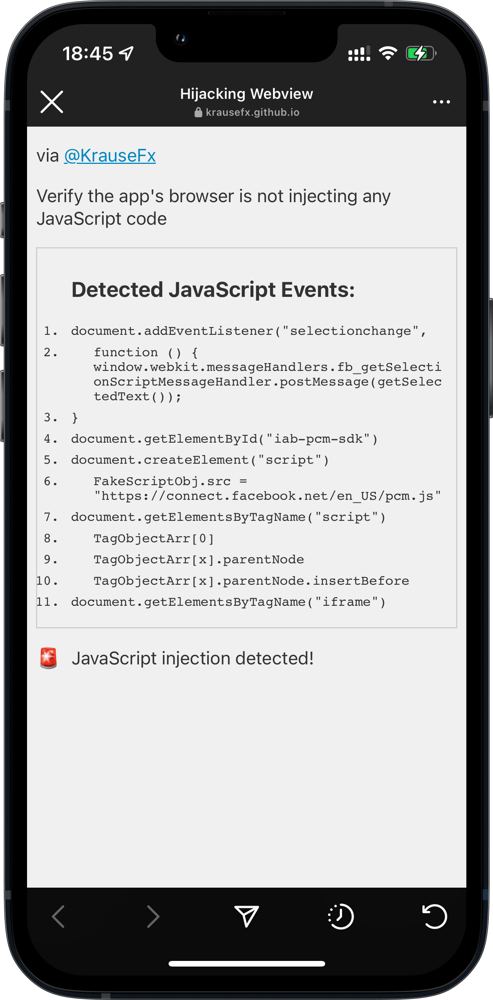
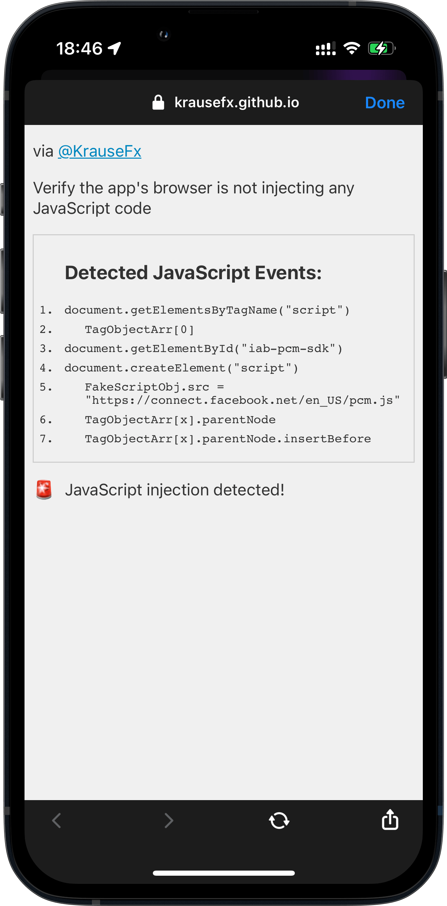
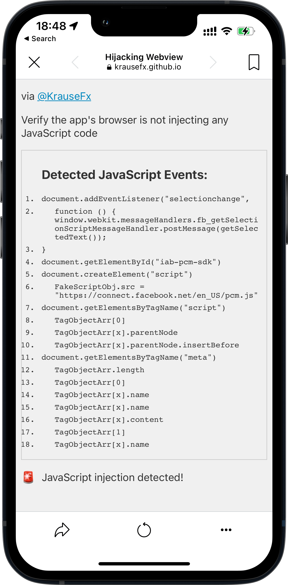
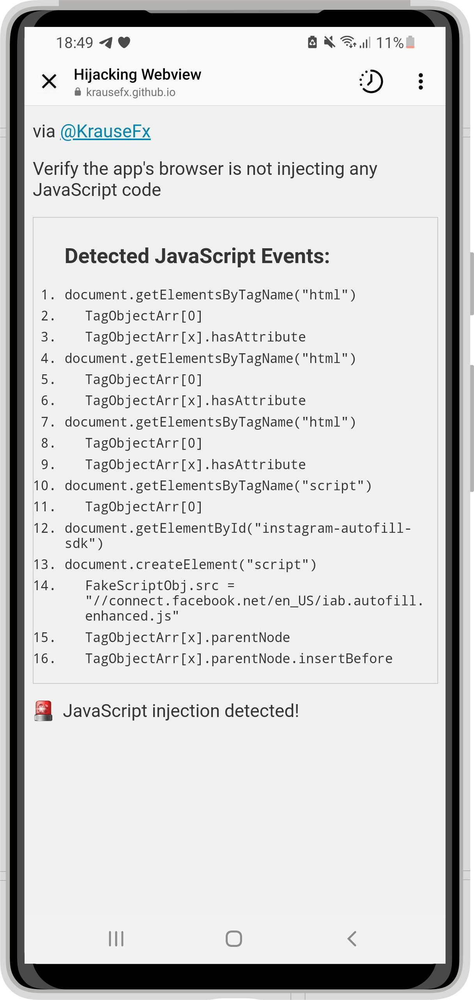
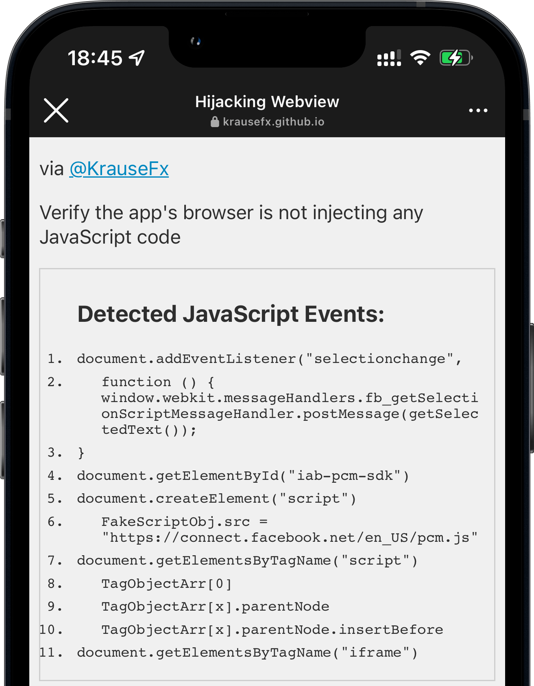
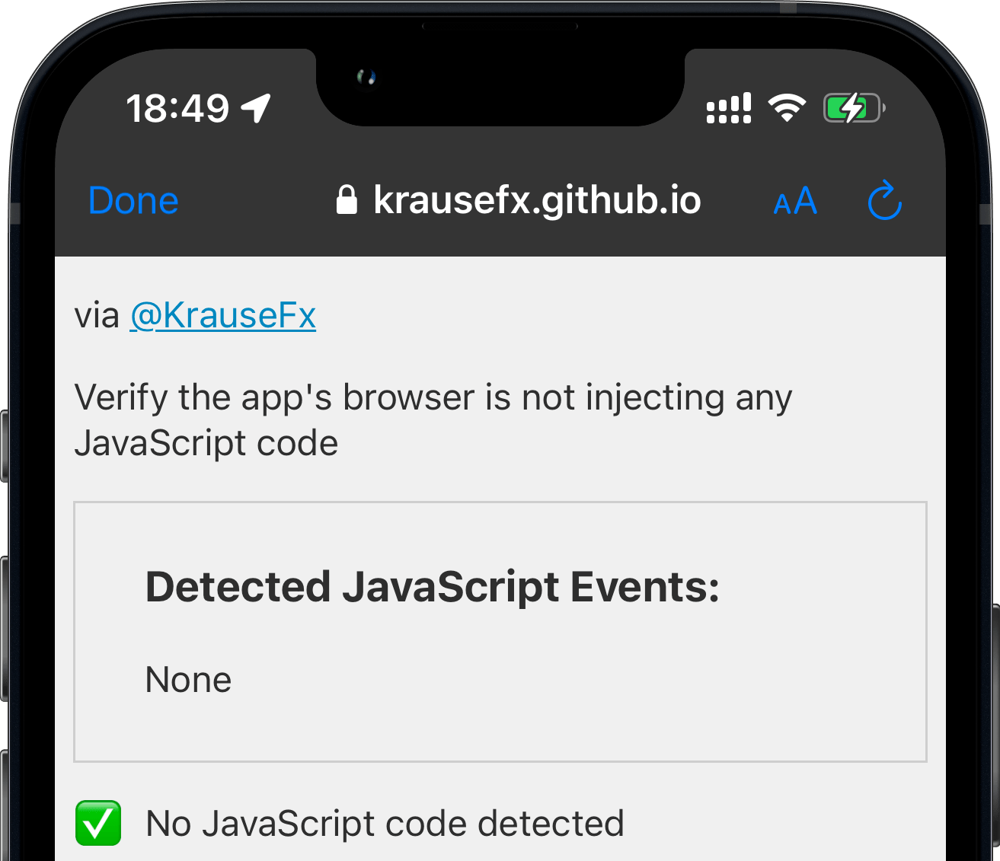
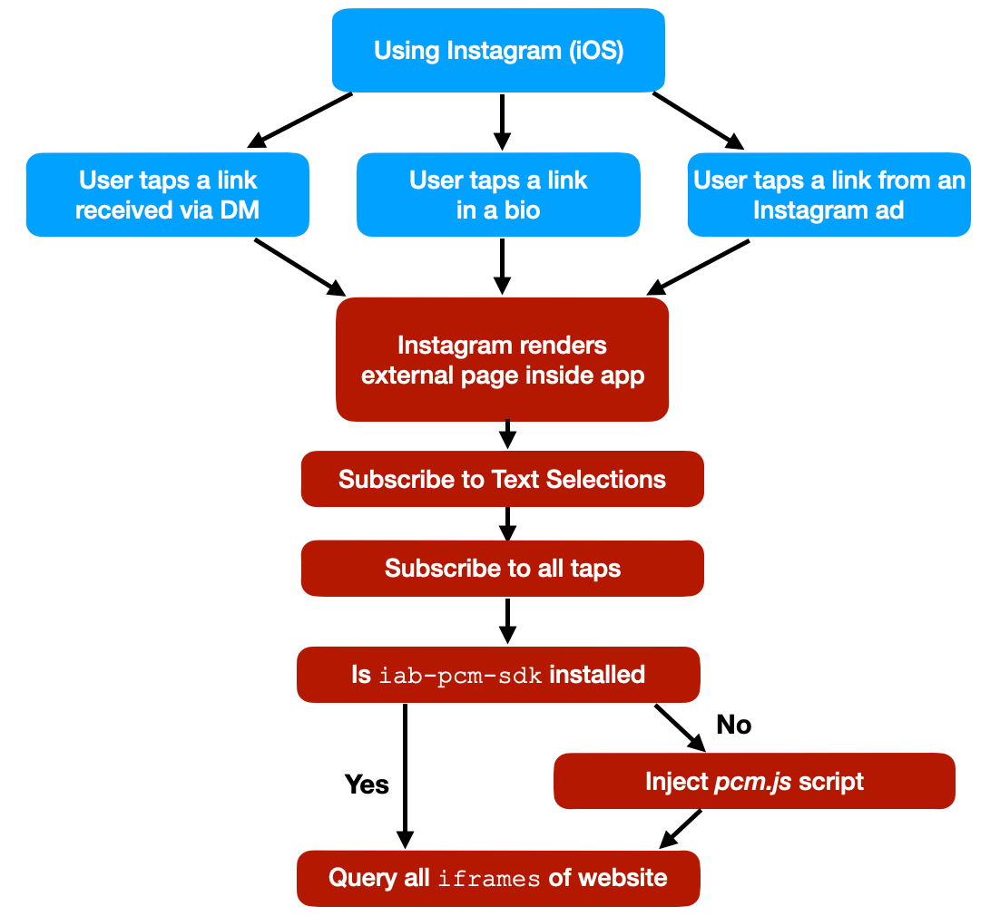
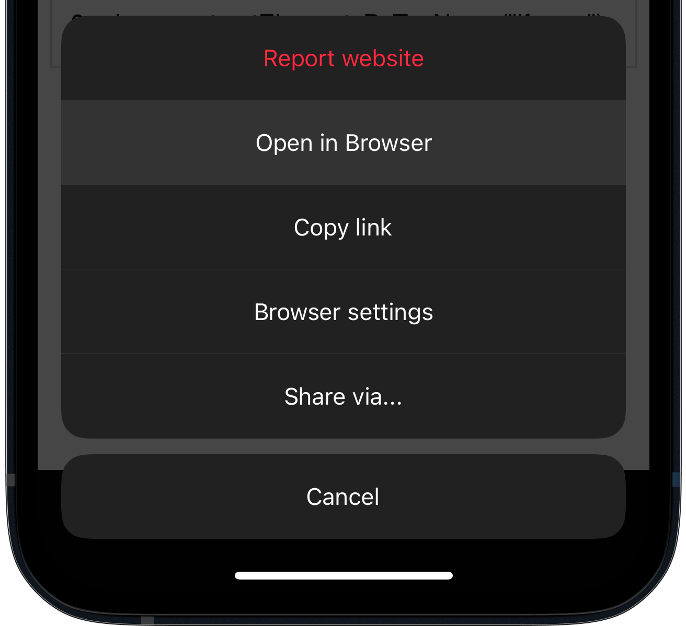
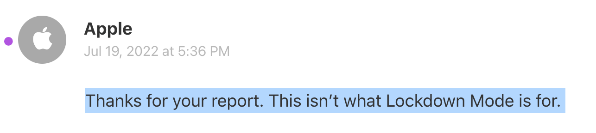

标题：【译】iOS 隐私：Instagram 和 Facebook 可以在应用内置浏览器跟踪你做的任何事
原文：[iOS Privacy: Instagram and Facebook can track anything you do on any website in their in-app browser](https://krausefx.com/blog/ios-privacy-instagram-and-facebook-can-track-anything-you-do-on-any-website-in-their-in-app-browser)
作者：[Felix Krause](https://github.com/KrauseFx)
译者：[Palm Civet](https://github.com/palmcivet)

---

**更新**：一周后，我又发布了一篇文章，研究了包括 TikTok 在内的其他应用程序，在其中还发现了 Instagram 的另一个 JavaScript 事件监听器，可以监视第三方网站内的所有点击。

点击查看：[iOS Privacy: Announcing InAppBrowser.com - see what JavaScript commands get injected through an in-app browser](https://krausefx.com/blog/announcing-inappbrowsercom-see-what-javascript-commands-get-executed-in-an-in-app-browser)

> 译者注：新文章的译文见 []()。

---

iOS 的 Instagram 和 Facebook 使用一个自定义的应用内置浏览器（in-app browser，下称“内置浏览器”），在其应用内渲染所有第三方链接和广告。这 [给用户带来了各种风险](https://krausefx.com/blog/follow-user "follow-user")，从密码和地址等所有表格输入到每一次点击，用户与外部网站的每一次交互，宿主应用（host app）都能够跟踪到。

> 注：为了保持行文简洁，后续我将只使用 "Instagram" 而不是 "Meta "或 "Facebook"。

> 译注：其实作者在下文还是用了很多 “Instagram 和 Facebook”，哈哈哈。

## Instagram 做了什么？

- 到外部网站的链接都在 Instagram 应用内渲染，而不是使用内置的 Safari。
- 这使得 Instagram 可以监控在外部网站发生的一切，而无需征得用户或者网站提供方的同意。
- Instagram 应用在每一个打开的网站包括点开的广告里注入 [他们的 JavaScript 代码](https://connect.facebook.net/en_US/pcm.js "pcm.js")。即使注入的代码目前不这么做，但在第三方网站上运行自定义脚本确实能让他们监控用户的所有交互，比如按钮、链接的每一次点击，文本的选择，屏幕截图，以及任何表单输入，如密码、地址和信用卡号。

## 为什么这是一个大问题？

- 苹果公司致力于对抗跨主机追踪：
    - 从 iOS 14.5 开始，[*App Tracking Transparency* 使用户处于控制地位](https://support.apple.com/en-us/HT212025 "Apple docs")：应用程序在不同厂商的应用之间跟踪数据需要获得用户的许可。
    - Safari 早已 [阻止了第三方 Cookie](https://webkit.org/blog/10218/full-third-party-cookie-blocking-and-more/ "webkit's blog")。

    > 译注：App Tracking Transparency（ATT）是苹果官方从 iOS 14 开始重点强调的申请用户广告追踪权限相关的 framework。
- Google Chrome [即将逐步淘汰第三方 Cookie](https://blog.chromium.org/2020/01/building-more-private-web-path-towards.html "Chromium's blog")。
- Firefox 刚刚公布了默认情况下的 [*Total Cookie Protection*](https://blog.mozilla.org/en/mozilla/firefox-rolls-out-total-cookie-protection-by-default-to-all-users-worldwide/)，以防止任何跨页面的跟踪。
- 一些互联网服务提供商（ISP）曾经将他们自己的[跟踪/广告代码注入所有的网站](https://www.infoworld.com/article/2925839/code-injection-new-low-isps.html)，不过这只能对未加密的网页有效。随着 [默认的 HTTPS 的兴起](https://transparencyreport.google.com/https/overview)，这不再是一个明智的选择了。然而 Instagram 和 Facebook 应用这里使用的方法适用于任何网站，不管它是否加密。

在 *App Tracking Transparency* 引入之后，Meta 宣布：

> Apple’s simple iPhone alert is costing Facebook $10 billion a year
>
> Facebook complained that Apple’s App Tracking Transparency favors companies like Google because App Tracking Transparency “carves out browsers from the tracking prompts Apple requires for apps.”
>
> Websites you visit on iOS don’t trigger tracking prompts because the anti-tracking features are built in.
>
> – [Daring Fireball](https://daringfireball.net/linked/2022/02/03/facebook-apple-browser-carve-out) & [MacWorld](https://www.macworld.com/article/611551/facebook-app-tracking-transparency-iphone-quarterly-results.html)

> 苹果公司简单的 iPhone 提示使 Facebook 每年损失 100 亿美元。
>
> Facebook 抱怨说，苹果的 *App Tracking Transparency* 有利于谷歌等公司，因为 *App Tracking Transparency* “把浏览器从苹果要求的应用跟踪提示中剔除了”。
>
> 你在 iOS 上访问网站不会触发跟踪提示，因为反跟踪功能是内置的。

Instagram 有 10 亿活跃用户，通过将跟踪代码注入到从 Instagram 和 Facebook 应用打开的每个第三方网站，可以收集到的数据量惊人。

随着 Web 浏览器和 iOS 给用户增加越来越多的隐私控制，Instagram 对监控外部网站所有网络流量感兴趣的原因就显而易见了。

> Facebook 用信息轰炸用户，乞求他们重新开启追踪功能。它威胁要对苹果提起反垄断诉讼。它让小企业为用户追踪进行辩护，声称当一个巨大的公司对数十亿人进行监视时，这就是一种小企业的发展。

2022-08-11 添加的说明：Meta 遵循 ATT（App Tracking Transparency）规则（见文章底部添加的说明）。我解释上述内容是为了提供一些背景信息，说明为什么从第三方网站/应用程序获取数据是一个大问题。这篇文章的信息是关于 iOS Instagram 应用如何用他们的内置浏览器主动在第三方网站中注入和执行 JavaScript 代码。这篇文章不论及这些事情的法律层面，而是讨论它们的技术实现，以及技术层面上的可行性。

## 针对非技术读者的 FAQ

- **Instagram/Facebook 可以知道我在网上的任何事吗？** 不能！Instagram 只有在你从他们的应用程序中打开链接或广告时，才能够读取和监视你的上网行为。
- **Facebook 真的会窃取我的密码、地址和信用卡号吗？** 没有！我没有能证明 Instagram 正在跟踪的确切数据，但我想展示一下他们可以在你不知情的情况下获得什么样的数据。正如过去那样，如果一家公司有可能合法地、免费地获得数据，而不需要征求用户的同意，那么他们就会追踪这些数据。
- **我该怎样才能保护自己？** 有关完整的细节，[请向下滚动到文章的结尾](#作为用户如何保护自己)。摘要：每当你从Instagram（或 Facebook、Messenger）打开链接，请一定要点击角落里的小圆点，在 Safari 浏览器中打开页面（open the page in Safari），以代替在内置浏览器打开。

### 什么东西被注入了？

Instagram 注入的外部 JavaScript 文件是 [connect.facebook.net/en_US/pcm.js](https://connect.facebook.net/en_US/pcm.js)，这是用来构建与宿主应用通信桥梁（bridge）的代码。根据 Meta 公司为回应本文而提供给我的信息，注入的外部脚本有助于收集事件，如在线购物事件，然后再将这些事件用于 Facebook 平台的定向广告推送和度量。

### 免责声明

我并没有 Instagram 所收集到的准确的数据清单。但我确实有证据表明，Instagram 和 Facebook 的应用主动运行 JavaScript 命令，在未经用户同意的情况下注入一个额外的 JavaScript SDK，以及跟踪用户的文本选择。如果 Instagram 已经这样做了，那么它们也可以注入任何其他的 JavaScript 代码。Instagram 应用自身对中间人攻击具有很好的防护，所以只能通过修改安卓二进制文件来注销证书，并在模拟器中运行它。

总而言之，这个项目的目标并不是要得到一份发回的数据清单，而是要强调使用内置浏览器所带来的隐私和安全问题，以及 **证明像 Instagram 这样的应用已经在利用这个漏洞**。

总结一下拥有内置浏览器的风险和劣势：

- **隐私和分析**。宿主应用可以切实地跟踪网站上发生的一切，每一次点击、输入、滚动行为、哪些内容被复制和粘贴，以及如在线购物等显示的数据。
- **窃取用户凭证，物理地址**，API 密钥等。
- **广告和推荐**。宿主应用可以将广告注入网站，或替换广告 API 密钥以窃取网站收入，或替换所有 URL 使其包含你的推荐代码（[这种情况以前发生过](https://twitter.com/cryptonator1337/status/1269201480105578496 "Twitter 链接")）。
- **安全性**。浏览器长期致力于优化安全的 Web 用户体验，比如显示 HTTPS 的加密状态，警告用户有可疑或未加密的网站，等等。
- 在第三方网站上注入额外的 JavaScript 代码会导致问题和故障，有可能破坏网站。
- 用户的浏览器扩展和内容拦截器不可用。
- 深度链接在大多数情况下效果并不好。
- 通常没有简单的方法通过其他平台分享链接（例如通过电子邮件、AirDrop 等）。

Instagram 的内置浏览器支持自动填写你的地址和支付信息，但这一开始就没有必要，所有的这些都已经内置在操作系统或 Web 浏览器了。

## 测试不同 Meta 公司的应用

<table class="hijacking-report-screenshot-table">
  <tbody>
    <tr>
      <th>Instagram iOS</th>
      <th>Messenger iOS</th>
    </tr>
    <tr>
      <td>
        
      </td>
      <td>
        
      </td>
    </tr>
  </tbody>
</table>
<table>
  <tbody>
    <tr>
      <th>Facebook iOS</th>
      <th>Instagram Android</th>
    </tr>
    <tr>
      <td>
        
      </td>
      <td>
        
      </td>
    </tr>
  </tbody>
</table>

WhatsApp 是默认打开 iOS Safari 的，所以没有问题

## 这是怎么做到的

据我所知，目前还没有好的方法来监控所有被宿主 iOS 应用执行的 JavaScript 命令（[如果有更好的方法，我想听听](https://twitter.com/KrauseFx "Twitter 主页")）。

我创建了一个新的纯文本 HTML 文件，用一些 JS 代码重写了 `document` 的部分方法：

```js
document.getElementById = function(a, b) {
    appendCommand('document.getElementById("' + a + '")')
    return originalGetElementById.apply(this, arguments);
}
```

在 iOS Instagram 应用中打开该 HTML 文件，结果如下：



将此与使用普通浏览器时的情况相比较，或者在本例中，使用推荐的 [`SFSafariViewController`](https://developer.apple.com/documentation/safariservices/sfsafariviewcontroller "Apple Docs") 的 Telegram 情况如下：



如你所见，一个普通的浏览器，或 [`SFSafariViewController`](https://developer.apple.com/documentation/safariservices/sfsafariviewcontroller "Apple Docs") 并不运行任何 JS 代码。[`SFSafariViewController`](https://developer.apple.com/documentation/safariservices/sfsafariviewcontroller "Apple Docs") 是一个应用开发者向用户展示第三方 Web 内容的好方法，不需要离开应用，还能为用户提供隐私和便捷。

## 技术细节



- Instagram 添加了一个新的事件监听器，以获得用户每次在网站上所选任何文本的细节。与监听屏幕截图相结合，使得 Instagram 能够充分了解哪些特定的信息被选择和分享。
- Instagram 检查是否有一个 ID 为 `iab-pcm-sdk` 的元素。根据 [这条推文](https://twitter.com/abx1n/status/1557796015364718593)，`iab` 可能指的是“应用程序内浏览器”。
- 如果没有找到 ID 为 `iab-pcm-sdk` 的元素，Instagram 就会创建一个新的 `script` 元素，将其 `src` 设置为 `https://connect.facebook.net/en_US/pcm.js`。
- 然后，它在你的网站上找到第一个 `script` 元素，将 pcm 的 JavaScript 文件插在前面。
- Instagram 也会在你的网站上查询 `iframes`，然而我没找到任何他们要做小动作的端倪。

**更新**：一周后，我又发布了 [一篇文章](https://krausefx.com/blog/announcing-inappbrowsercom-see-what-javascript-commands-get-executed-in-an-in-app-browser)，研究了包括 TikTok 在内的其他应用，在其中还发现了 Instagram 的另一个 JavaScript 事件监听器，特别是：

- Instagram iOS 应用监听了在应用内打开的外部网站的所有 button、link、image 或其他组件的事件。
- Instagram iOS 应用监听了用户所有选择第三方 UI 元素（如文本字段）的时间。

[点击阅读全文](https://krausefx.com/blog/announcing-inappbrowsercom-see-what-javascript-commands-get-executed-in-an-in-app-browser)

> 译者注：同开头说的文章，[点击阅读译文]()

### 作为用户，该如何保护自己
#### 远离应用内 WebView

大多数内置浏览器都支持“在 Safari 中打开网页”（译者注：通用说法是 “在浏览器中打开”）。一打开页面，就点击这个选项，离开内置浏览器。如果不支持这个操作，那么可以复制粘贴网站 URL，在你所使用的浏览器中打开。



#### 使用 Web 版

大多数社交网站，包括 Instagram 和 Facebook，都对移动端的 Web 页面做了不错的适配，提供跟应用类似的功能。你可以在 iOS Safari 中无障碍地使用 https://instagram.com。

### 作为网站提供方，该如何保护自己

在 Instagram 解决这个问题（如果会的话）之前，你可以很容易地欺骗 Instrument 和 Facebook 相信跟踪代码已经安装。只需要添加以下 HTML 代码：

```html
<span id="iab-pcm-sdk"></span>
<span id="iab-autofill-sdk"></span>
```

此外，为避免 Instagram 在你的网站上跟踪用户文本选择的操作：

```js
const originalEventListener = document.addEventListener
document.addEventListener = function(a, b) {
  if (b.toString().indexOf("messageHandlers.fb_getSelection") > -1) {
    return null;
  }
  return originalEventListener.apply(this, arguments);
}
```

这段代码并不能实质上解决 Instagram 在你网站上运行 JavaScript 代码的问题，但至少可以避免注入另外的 JS 脚本，同时也能避免更多的数据被跟踪。

一个 Web 应用也可以很容易通过 User Agent 来检测当前浏览器是否为 Instagram / Facebook 应用，不过我还没有找到一种好的办法，能够自动退出内置浏览器，并主动打开 Safari。如果你有解决方案，[我很想了解](https://twitter.com/KrauseFx)。

**2022-08-11 更新**：[Adrian 发布了一篇关于这个话题的文章](https://www.holovaty.com/writing/framebust-native-apps/)，照应了本文。

## 倡议
### 针对 Apple 公司

Apple 在构建平台时非常注重用户隐私，并对此做了很多有意义的工作。其四个隐私原则之一是：

> **App Tracking Transparency**: Making sure that users know what data is shared and how it is used, and that they can exercise control over it.

> **App Tracking Transparency**：确保用户知道分享了哪些数据，以及如何使用这些数据，并且他们可以对其进行控制。

\- [Apple Privacy PDF](https://www.apple.com/privacy/docs/A_Day_in_the_Life_of_Your_Data.pdf) （2021 年 4 月）

在写这篇文章的时候，AppStore 还没有相关审核规则可以禁止公司构建自己的内置浏览器来跟踪用户、读取他们的输入，或者向第三方网站注入额外的广告。但是苹果有明确推荐使用 [`SFSafariViewController`](https://developer.apple.com/documentation/safariservices/sfsafariviewcontroller)：

> Avoid using a web view to build a web browser. Using a web view to let people briefly access a website without leaving the context of your app is fine, but Safari is the primary way people browse the web. Attempting to replicate the functionality of Safari in your app is unnecessary and discouraged.

> 避免使用 Webview 来构建 Web 浏览器。使用 Webview 让人们在不离开你的应用的情况下简单地访问一个网站是允许的，但是 Safari 是人们浏览网页的主要方式。试图在你的应用内在一个 Safari 的轮子是没有必要的，也是不鼓励的。

\- [Apple Human Interface Guidelines](https://developer.apple.com/design/human-interface-guidelines/components/content/web-views/) （2022 年 6 月）

> If your app lets users view websites from anywhere on the Internet, use the SFSafariViewController class. If your app customizes, interacts with, or controls the display of web content, use the WKWebView class.

> 如果你的应用需要让用户查看互联网上的任何网站，那么请使用 `SFSafariViewController` 类。如果你的应用需要定制、交互或控制 Web 内容的显示，那么请使用 `WKWebView` 类。

\- [Apple SFSafariViewController docs](https://developer.apple.com/documentation/safariservices/sfsafariviewcontroller)（2022 年 6 月）

#### 引入 `App-Bound Domains`

[App-Bound Domains](https://webkit.org/blog/10882/app-bound-domains/) 是一个优秀的 `Webkit` 新特性，使得开发者能够在使用 `WKWebView` 时拥有更安全的应用内浏览体验。作为一个应用开发者，你可以定义应用能够访问的域名列表，所有网络请求都会被限制在这些域名内。如果用户想要禁用这项防护，则必须在 iOS 应用的设置里显式关闭。

App-Bound Domains 是在 iOS 14（大约 1 年半前）上线的，但它只是一个开发者可选的选项，这意味着绝大多数 iOS 应用没有使用这个功能。

> If the developers of SocialApp **want a better user privacy experience** they have two paths forward:
>
> - Use `SafariViewController` instead of `WKWebView` for in-app browsing. `SafariViewController` protects user data from SocialApp by loading pages outside of SocialApp’s process space. SocialApp can guarantee it is giving its users the best available user privacy experience while using SafariViewController.
> - Opt-in to App-Bound Domains. The additional `WKWebView` restrictions from App-Bound Domains ensure that SocialApp is not able to track users using the APIs outlined above.

> 如果社交应用的开发者 **想要提供更好的用户隐私体验**，他们有两条途径可以选择：
>
> - 使用 `SafariViewController` 而不是 `WKWebView` 来实现应用内浏览。`SafariViewController` 通过在应用的进程空间之外加载页面，来实现保护用户数据。社交应用可以保证在使用 `SafariViewController` 时为用户提供可享受的最好的隐私体验。
> - 启用 App-Bound Domains。App-Bound Domains 对 `WKWebView` 的额外限制可以确保社交应用不能使用上述的 API 来跟踪用户。

- [App-Bound Domains](https://webkit.org/blog/10882/app-bound-domains/)（译者注：原文没有给出，虽然出处显而易见）

我高亮了 `想要提供更好的用户隐私体验` 部分，因为这是缺失的部分：所有 iOS 应用都应该开启 App-Bound Domains，因为注入跟踪代码的都是社交应用。

2022 年 7 月，苹果推出了 [Lockdown Mode](https://www.apple.com/newsroom/2022/07/apple-expands-commitment-to-protect-users-from-mercenary-spyware/)，以更好地保护高风险人群。不幸的是，iOS  Lockdown Mode 并没有改变应用内 WebView 的工作方式。我已经向 Apple 提交了一个 radar：[rdar://10735684](https://openradar.appspot.com/radar?id=5500665535135744)，苹果回复“这不是锁定模式的用途”：



#### Apple 应该立即采取的几个步骤

更新 AppStore 审核规则，要求展示任何第三方网站时使用 [`SFSafariViewController`](https://developer.apple.com/documentation/safariservices/sfsafariviewcontroller) 或启用 [App-Bound Domains](https://webkit.org/blog/10882/app-bound-domains/)。

- 只有少数例外情况（例如浏览器应用程序），需要两个额外的步骤：
  - 请求一个额外的权限，以确保它是一个有效的用例
  - 让用户确认额外的权限
- 第一方网站/内容仍然可以使用 `WKWebView` 类来显示，因为它们通常用于 UI 元素，或者应用程序实际上修改了它们自己的内容（例如自动关闭自己的 Cookie 横幅）

我也在我 [之前的博客文章](https://krausefx.com/blog/follow-user) 撰写过程中向苹果提交了一个 radar（[rdar://38109139](https://openradar.appspot.com/radar?id=4963695432040448)）。

### 针对 Meta 公司

像 Meta 已经在 WhatsApp 上做的那样：停止修改第三方网站，并使用 Safari 或 [`SFSafariViewController`](https://developer.apple.com/documentation/safariservices/sfsafariviewcontroller) 来访问所有第三方网站。这是对用户最好的，也是正确的做法。

我已经通过 Meta 的 [Bug Bounty Program](https://www.facebook.com/whitehat/profile/FelixKrause) 向他们披露了这个问题，在几个小时内他们确认了他们能够复现这个“问题”，但是在过去的 9 周内，除了让我等待更长的时间直到他们有一个完整的报告，我没有听到任何其他的回复。由于他们没有回答我的后续问题，也没有停止向外部网站注入跟踪代码，我决定公开这些信息（在给他们另外两周的提前通知后）。

### 2022-08-11 更新（Meta 提供的信息）

这篇文章发表后，Meta 发了两封电子邮件，澄清了他们在做什么。我处理了他们的解释，以下是发生的变化：

- 注入的脚本不是 [Meta Pixel](https://developers.facebook.com/docs/meta-pixel/)，而是 [pcm.js](https://connect.facebook.net/en_US/pcm.js)，根据 Meta 的说法，这个脚本有助于聚合事件，比如在线购买，然后这些事件被用于 Facebook 平台的定向广告推送和度量
- 根据 Meta 的说法，注入的脚本（[pcm.js](https://connect.facebook.net/en_US/pcm.js)）有助于 Meta 尊重用户的 ATT 退出选择，这只有在渲染的网站安装了 Meta Pixel 时才有意义。然而，据我所知，如果 Instagram 选择打开手机的默认浏览器，而不是构建和使用自定义的内置浏览器，那所有这些都可以不需要。

我给 Meta 发了一些后续的问题。一旦我收到回复，我会相应地更新文章，并在 [Twitter](https://twitter.com/KrauseFx) 上公布改动。

与此同时，这篇文章中发布的一切都是正确的：Instagram 应用程序正在执行和注入 JavaScript 代码到第三方网站，这些网站在他们的内置浏览器中渲染，这给用户带来了极大的风险。另外，没有办法选择不使用自定义的内置浏览器。

在 Meta 给我提供更多背景和细节的同时，我也更新了文章以反映这些信息。你可以 [在这里](https://github.com/KrauseFx/krausefx.com/commits/master) 找到文章的完整历史和变更内容。

### 2022-08-14 更新（Meta 提供的信息）

我问的主要问题是：如果 Meta 构建了一整套系统，将 JavaScript 代码（`pcm.js`）注入到第三方网站中，[以尊重用户的 App Tracking Transparency（ATT）选择](https://twitter.com/andymstone/status/1557825254675841025)，那为什么 Instagram 不直接在用户的默认浏览器中打开所有外部链接呢？这样就可以让用户完全控制自己的隐私设置，而且不需要 Meta 在这方面做任何工程上的努力。

对此，回应是：

> As shared earlier, pcm.js is required to respect a user’s ATT decision. The script needs to be injected to authenticate the source and the integrity (i.e. if pixel traffic is valid) of the data being received. Authentication would include checking that, when data is received from the In App Browser through the WebView-iOS native bridge, it contains a valid nonce coming from the injected script. SFSafariViewController doesn’t support this. There are additional components within the In App Browser that provide security and user features that SFSafariViewController also doesn’t support.

> 正如之前分享的，pcm.js 是必须的，用于尊重用户的 ATT 决定。这个脚本需要被注入，以验证所接收数据的来源和完整性（例如像素流量是否有效）。验证包括检查当从内置浏览器通过 WebView-iOS 原生 bridge 接收到数据时，是否有包含来自注入脚本的有效随机数。SFSafariViewController 不支持这个功能。内置浏览器中还包含了一些其他组件，提供安全性和用户特性，这也是 SFSafariViewController 所不支持的。

尽管这个答案提供了一些背景，但我不认为它回答了我的问题。其他应用，包括 Meta 自己的 WhatsApp，都可以在不使用自定义内置浏览器的情况下完美地运行。

我给 Meta 提交的工单被标记为已解决，`given the items raised in your submission are intentional and not a privacy concern`（“因为你提交的问题是有意为之，而不是一个隐私问题”）。

我的第二个问题是关于用户文本选择的跟踪，根据 Meta 的说法，这是一些旧的代码，已经不再使用了：

> In older versions of iOS, this code was necessary to allow users to share selected text to their news feed. As newer versions of iOS have built-in functionality for text selection, this feature has been deprecated for some time and was already identified for removal as part of our standard code maintenance. There is no code in our In App Browser that shares text selection information from websites without the user taking action to share it themselves via a feature (like quote share).

> 在旧版本的 iOS，这段代码是必要的，可以让用户将选中的文本分享到他们的新闻源。由于新版本的 iOS 已经内置了文本选择，这个功能已经被废弃了一段时间，并且已经在我们的标准代码维护项目中标记为移除。我们的内置浏览器中没有任何代码会在用户没有通过某个功能（比如引用分享）自己主动分享的情况下，分享网站上的文本选择信息。

查看我 [其他与隐私和安全相关的文章](https://krausefx.com/privacy)。
